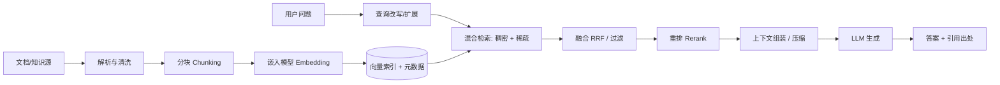
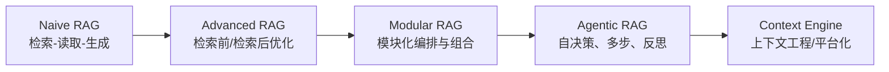

> 本文是一份"从零开始系统掌握 RAG"的知识梳理讲义，以问答形式组织，按"解决什么问题 → 怎么实现 → 如何演进 → 有哪些关键技术 → 如何评测 → 最新实践"的脉络推进，适合作为复习提纲与速查手册。文中的结论均来自论文与社区工程实践，参考文献以脚注 `[^n]` 形式给出；由于领域迭代极快，"最新实践"部分以截至 **2026 年 8 月**的公开资料为准。

## 一、RAG 是什么？最早的 RAG 解决什么问题？

### 1. 先看大语言模型的三块短板

**幻觉（Hallucination）**：大语言模型本质上是"根据上文预测下一个 token"的概率模型。它没有数据库，也没有"查证"机制，所有知识都压缩在参数里。遇到训练数据覆盖不足的内容，就会输出语法流畅但事实错误的话。

**知识过期（Knowledge Cutoff）**：训练数据存在截止日期，之后的事件、政策、文档模型一概不知，也不会自动感知"世界已经变了"。

**不可追溯（Lack of Traceability）**：模型回答通常不说"我依据了什么"。在金融、医疗、合规等场景，没有出处、无法回溯的答案无法被信任与审计。

这三块短板正是 RAG 诞生的直接动因[^1]。

### 2. 为什么不直接微调？

面对新知识，直觉方案是微调（Fine-tuning），但微调有硬伤：

- **时效性差**：知识库一更新就要重训，周期与成本不可接受；
- **容量有限**：权重能"记住"的知识远少于一个可扩展的数据库；
- **灾难性遗忘**：学新知识可能破坏原有能力；
- **不可追溯**：知识被压进权重后，反而更拿不出证据来源。

RAG 换了一个思路：**模型不必记住所有知识，只需要知道"去哪里查"**。生成时先从外部知识库检索证据，再把证据作为上下文交给模型作答。知识更新只需更新外部索引，答案自带出处。

学术界把这种设计概括为：LLM 是**参数化记忆（parametric memory）**，外部检索库是**非参数化记忆（non-parametric memory）**，两者结合即检索增强生成（Retrieval-Augmented Generation, RAG）[^1]。

### 3. 最早的 RAG 解决什么问题？

RAG 的奠基论文是 2020 年 Lewis 等人的《Retrieval-Augmented Generation for Knowledge-Intensive NLP Tasks》[^2]。它针对的是**知识密集型任务**（开放域问答、事实核查、知识推理等）中的两个核心问题：

1. **参数化模型"装不下、更不了"知识**：当时的主流做法是把知识全压进 seq2seq 模型参数，模型越大越贵，且知识无法低成本更新；
2. **生成结果缺乏证据支撑**：模型凭空"回忆"知识，没有检索依据，容易编造。

Lewis 等人的解法是把"检索"和"生成"以概率方式统一成一个可训练框架：

- 检索器 $p_\eta(z|x)$：给定问题 $x$，从非参数索引中检索文档 $z$（用 DPR 实现）；
- 生成器 $p_\theta(y_i|x, z, y_{1:i-1})$：基于问题和检索文档逐 token 生成答案（用 BART 实现）；
- 两种解码策略：
  - **RAG-Sequence**：整段答案共享同一个检索文档，对所有候选文档边际化：

    $$p(y|x) \approx \sum_{z \in \text{top-}k} p_\eta(z|x) \prod_i p_\theta(y_i | x, z, y_{1:i-1})$$

  - **RAG-Token**：每个 token 可以来自不同文档，逐 token 边际化：

    $$p(y|x) \approx \prod_i \sum_{z \in \text{top-}k} p_\eta(z|x) \, p_\theta(y_i | x, z, y_{1:i-1})$$

一句话总结最早 RAG 解决的问题：**在不大幅重训模型的前提下，让模型通过"检索-生成"获取最新、可溯源的外部知识，缓解幻觉并提升知识密集型任务的效果**[^2]。

### 4. RAG 的前传：检索与生成如何相遇

RAG 不是凭空出现的，它融合了信息检索（IR）与序列生成（Seq2Seq）两条线：

- **稀疏检索（BM25）**：词频加权的倒排检索，可解释、无需训练、快，但只能做字面匹配，解决不了"同义不同词"的词汇鸿沟；
- **DPR（Dense Passage Retrieval）**[^3]：2020 年 Facebook 提出，用双塔编码器（bi-encoder）把查询和段落编码成稠密向量，以向量内积衡量语义相似度，在开放域问答上显著超越 BM25，成为 RAG 检索器的默认实现；
- **REALM**[^4]：Google 把"检索"并入预训练目标，用掩码语言模型同时训练检索器与生成器，证明检索增强在预训练阶段就有知识收益；
- **FiD（Fusion-in-Decoder）**[^5]：解决了"检索到多个段落怎么用"——每个段落独立编码，解码时统一融合，检索段落越多效果越好；
- **Atlas**[^6]：把 Contriever 检索器与 T5 生成器联合预训练，仅用 64 个训练样例就在 Natural Questions 上超过 540B 参数的 PaLM，用事实证明了"检索比堆参数更划算"。

## 二、RAG 的完整流程是怎样的？——底层设计

从工程视角看，RAG 系统由**离线索引（Indexing）**与**在线查询（Retrieval + Generation）**两个阶段组成。

### 1. 离线索引阶段

**文档解析与清洗**：原始知识源有 PDF、Word、网页、表格、扫描件等。PDF 需要版面分析以保留标题层级与表格结构；网页要去掉导航、广告、页脚；表格要结构化（如转 Markdown 表格）；中文还需统一编码、繁简、全半角。解析质量直接决定下游检索上限。

**分块（Chunking）**：嵌入模型输入长度有限，长文档必须切块。分块是 RAG 工程中投入产出比最高的调优点，详见第三节。

**嵌入（Embedding）**：把文本块映射为向量。选型关注领域适配、多语言能力、是否支持多向量/稀疏输出、维度与量化。

**向量索引（ANN）**：百万级向量无法线性扫描，需用近似最近邻算法：

- **HNSW**：分层可导航小世界图，召回好、查询快，但内存占用大，默认首选；
- **IVF + PQ**：先聚类分桶再乘积量化压缩，省内存、召回略降；
- **稀疏倒排**：BM25 的 Lucene/Elasticsearch 实现，适合精确匹配。

工程上可直接使用 FAISS、Milvus、Qdrant、Weaviate、pgvector、Elasticsearch/OpenSearch 等，选型看数据量、并发、过滤能力与团队基础设施。

### 2. 在线查询阶段

**查询改写与扩展**：用户问题往往口语化、指代不清。常见做法是让 LLM 改写/补全问题、拆分子问题、生成同义改写后分别检索。

**混合检索 + RRF**：稀疏检索擅长精确匹配，稠密检索擅长语义匹配，二者互补。最常用的结果合并算法是 **Reciprocal Rank Fusion（RRF）**[^7]：

$$\text{RRF}(d) = \sum_{r \in \mathcal{R}} \frac{1}{k + \text{rank}_r(d)}$$

只依赖排名不依赖分数，规避了"稀疏分数与稠密分数不可比"的问题，$k$ 通常取 60，简单且鲁棒。

**重排（Rerank）**：召回阶段广撒网（50–100 个候选），用更强的模型精排后再取 Top-N（3–10）交给生成器：

- **Cross-Encoder**：查询与文档拼接后全交互编码，精度高但慢，适合小规模重排（如 bge-reranker、Cohere Rerank）；
- **Late Interaction（ColBERT）**[^8]：token 级最大相似度，兼顾精度与效率；
- **LLM 重排**：让大模型打分排序（如 RankGPT），效果好但成本高。

**上下文组装与压缩**：检索结果不是越多越好。按相关性排序（关键证据放前/后）、按时间与权限做元数据过滤、用 LLMLingua 类工具压缩冗余 token、用 MMR 去重保证多样性。

**生成与引用**：指令应明确"仅基于证据回答，证据不足时承认不知道"，并要求输出引用标记，把答案句子与证据块编号挂钩，实现可追溯。

## 三、内容如何分块？有哪些分块方法？现在最常用的是什么？

### 1. 为什么必须分块？

三个原因：嵌入模型有输入长度上限；整篇塞进向量无法精准定位"哪一段回答了问题"；分块大小影响检索粒度与上下文完整性。分块本质是在**检索精度**与**上下文完整性**之间做权衡[^9]。

### 2. 常见分块方法

- **固定大小分块（Fixed-size）**：按 token/字符数硬切，可加重叠（overlap）缓解语义截断。最简单，但容易切断句子与语义，适合代码、日志等格式统一的内容。
- **递归字符分块（Recursive Character Splitting）**：按"\n\n → \n → 空格 → 字符"的优先级递归切分，尽力保持段落、句子完整。这是 LangChain `RecursiveCharacterTextSplitter` 的思路，也是目前**通用场景最常用**的方法[^10]。
- **按句子/按段落分块**：中文按句号、分号切句，再按段落聚合，保证语义单元完整，符合中文阅读习惯；中文知识库常用。
- **语义分块（Semantic Chunking）**：用嵌入向量计算句间相似度，在"语义断裂点"处切分，使块内主题一致（如 LlamaIndex 的 `SemanticSplitterNodeParser`）。质量好，但需要额外计算，适合对检索质量要求高的场景。
- **结构感知分块（Structure-aware）**：按 Markdown 标题、HTML 标签、代码函数/类、表格行切分，保留结构与元数据，适合文档型知识库与代码库。
- **父子分块（Parent-Child / Small-to-Big）**：小粒度块用于检索命中，命中后回填其所属的大块作为上下文，兼顾"命中精度"与"上下文完整"，生产系统常见组合。

### 3. 现在最常用的是什么？

综合社区工程实践，可以给出一个比较稳妥的结论[^9][^10]：

- **通用默认**：递归字符分块（LangChain 生态的 `RecursiveCharacterTextSplitter` 是事实标准），参数为 `chunk_size`（块大小，常见 300–800 token）与 `chunk_overlap`（重叠，常见 10%–20%）；
- **中文文档**：常用按句子/段落分块，或递归分块 + 中文分隔符（句号、分号）定制；
- **质量优先**：升级为语义分块 + 结构感知分块 + 父子分块的组合；
- **调优铁律**：块大小与重叠没有普适最优值，必须以**评测驱动**——不同 chunk 配置在评测集上对比检索命中率与答案质量再定。

## 四、嵌入与向量索引怎么选？

### 1. 嵌入模型选型

- **领域适配**：通用模型 vs 代码/医疗/法律领域微调模型；
- **多语言能力**：中文场景优先选多语模型，如 BAAI 的 **bge-m3**[^11]，支持 100+ 语言，同时输出稠密向量、稀疏向量与多向量（ColBERT 式），一个模型即可支撑混合检索；
- **维度与量化**：高维向量更占存储，可用 INT8/PQ 量化压缩。

关于嵌入原理可参考站内文章《[词嵌入模型(Embedding Model)是什么](https://vortezwohl.github.io/nlp/2024/09/23/Embedding.html)》。

### 2. 相似度度量

稠密检索通常用**余弦相似度**（余弦距离）或**内积**。向量要归一化后内积等价于余弦；欧氏距离对向量尺度敏感，使用较少。混合检索时稀疏与稠密分数不可直接相加，一般用 RRF 融合。

## 五、RAG 的发展历程：Naive → Advanced → Modular → Agentic

Gao 等人的综述把 RAG 分为 **Naive、Advanced、Modular** 三个阶段[^1]，社区通常把 **Agentic RAG** 视为第四个阶段，主线是"从被动管道走向主动系统"[^12][^13]。

### 1. Naive RAG：朴素三段式

Index → Retrieve → Generate：建索引、检索 Top-K、拼上下文生成。能跑通，但召回精度低、生成被噪声误导、上下文冗余、缺少优化环[^12]。

### 2. Advanced RAG：检索前/检索后优化

- **检索前（Pre-retrieval）**：优化索引（分块、元数据、父子块）与查询（改写、扩展、HyDE）；
- **检索后（Post-retrieval）**：重排、压缩、去重、过滤。

微软的 HyDE、Google 的重排、Elastic/Cohere 的混合检索与 Rerank 等共同构成了 Advanced RAG 的"工程配方"[^13]。

### 3. Modular RAG：组件化与编排

把系统拆成可插拔模块：**检索模块、记忆模块、路由模块、预测模块、任务适配器**。模块可新增、替换、重排、组合。典型例子是"检索路由"：先判断问题属于实时信息/私有知识/常识，再路由到不同检索器或直接生成。

### 4. Agentic RAG：让系统自己决定怎么查

LLM 从"管道中的一环"升级为"编排检索流程的决策者"：决定要不要检索、检索什么（拆子问题、选数据源）、检索几次（多跳、失败重试）、何时停止。代表工作有 Self-RAG 与 CRAG（见第六节）。Agentic RAG 效果更强，但链路更长、成本更高、更依赖模型的工具调用能力[^12]。

## 六、关键优化技术逐个拆解

### 1. 查询改写：Rewrite-Retrieve-Read

复旦团队发现"直接用原始问题检索"往往不佳，先让 LLM 把问题重写（泛化或具体化）再检索，能显著提升效果[^14]。

### 2. HyDE：假设性文档嵌入

查询时先用 LLM 基于问题"编造"一段假设答案，再对假设答案做嵌入去检索。因为"答案与文档"的相似度通常高于"问题与文档"，HyDE 在零样本、无标注场景表现突出；代价是每次查询多一次 LLM 调用[^15]。

### 3. Self-RAG：让模型反思"要不要查、查得好不好"

训练模型在生成时输出两类反思 token：**检索决策 token**（Retrieve / No-Retrieve）与**批判 token**（文档是否相关、答案是否被证据支持），据此自适应决定检索次数，并基于证据支持度筛选候选输出[^16]。

### 4. CRAG：检索出错时的纠正机制

先用轻量评估器给检索结果打分（正确/模糊/错误）：正确→精炼后生成；错误→触发网络搜索回退并把查询拆成子查询重新检索；模糊→本地与网络结果并用[^17]。

### 5. FLARE：生成过程中的主动检索

先生成一个句子，若句中有低置信 token，就基于该句检索并重写这句，"边写边查"适合长文档、多步骤生成[^18]。

### 6. RAPTOR：树状分层检索

把文档块聚类→对簇生成摘要→再聚类、再摘要，形成递归抽象树。检索时既可从叶子块精确命中，也可从高层摘要回答全局性问题[^19]。

### 7. 上下文压缩

检索到的证据常常冗余，可用提示词压缩技术（如 LLMLingua 系列）按困惑度删除低信息 token，降低 token 成本与噪声。站内已有深度调研：《[LLMLingua 深度调研](https://vortezwohl.github.io/ai/2026/07/23/LLMLingua系列深度调研.html)》。

## 七、知识图谱：GraphRAG 是什么？与向量 RAG 有何区别？

### 1. 动机：向量 RAG 答不了"全局性问题"

向量 RAG 擅长**局部性问题**（"某某文档第几节怎么写的"），但回答不了**全局性问题**（"整个语料讲了什么""这些实体之间什么关系""总体趋势如何"）——因为分块检索只能看到片段，看不到整体。

### 2. GraphRAG 的做法

微软的 GraphRAG[^20] 用知识图谱替代向量作为索引：

1. **实体与关系抽取**：用 LLM 从文档中抽取实体、关系、属性，构建图；
2. **社区检测**：用 Leiden 算法把图划分成社区；
3. **层级摘要**：对每个社区生成摘要，再对摘要分层汇总；
4. **查询生成**：回答全局性问题时，用 map-reduce 方式遍历社区摘要汇总答案（Query-Focused Summarization）。

### 3. 与向量 RAG 的对比

| 维度 | 向量 RAG | GraphRAG |
| --- | --- | --- |
| 索引单元 | 文本块向量 | 实体/关系图 + 社区摘要 |
| 擅长问题 | 局部性、单点事实 | 全局性、关系性、多跳推理 |
| 构建成本 | 低（解析+嵌入） | 高（LLM 抽取实体关系） |
| 更新成本 | 低（增量重嵌入） | 高（图与摘要需重建） |
| 适用场景 | 通用问答、客服知识库 | 企业级文档理解、反欺诈、研究报告 |

### 4. 落地建议

GraphRAG 构建贵、更新难，适合离线、语料相对稳定的场景；生产中常见"向量 + 图"混合方案：局部问题走向量检索，全局问题走图摘要。开源变体 LightRAG、KAG 等旨在降低构建成本，可视为"用图做索引与检索"的工程实现[^12]。

## 八、RAG 的评测指标有哪些？

### 1. 分阶段指标

- **检索阶段**（需人工/自动标注相关性）：Recall@K、Precision@K、命中率（Hit Rate）、MRR（首个相关结果的倒数排名）、nDCG（考虑位置折扣）；
- **生成阶段**：开放域问答看 EM/F1（精确匹配/词重叠），摘要看 BLEU/ROUGE，事实性看忠实度（faithfulness）；
- **端到端**：直接评测最终答案质量，贴近用户感受，但难定位问题出在检索还是生成。生产建议两层都做。

### 2. 端到端框架：RAGAS

**RAGAS**[^21][^22] 是使用最广的自动化评估框架，核心指标：

- **忠实度（Faithfulness）**：答案中的每个陈述是否都能从检索上下文中找到依据（防幻觉）；
- **答案相关性（Answer Relevancy）**：答案是否切题，有没有答非所问；
- **上下文相关性（Context Relevance）**：进一步拆为**上下文精确率（Context Precision）**与**上下文召回率（Context Recall）**，衡量检索是否精准、是否漏证据。

RAGAS 用 LLM-as-a-Judge 打分，无需人工标注，适合日常回归。

### 3. 能力基准：RGB

**RGB（Retrieval-Augmented Generation Benchmark）**[^23] 从四个能力维度检验 RAG 系统：

1. **噪声鲁棒性**：混入无关文档时能否不被带偏；
2. **拒绝能力（Negative Rejection）**：知识库没有答案时能否说"不知道"而不是编造；
3. **信息整合**：答案横跨多篇文档时能否正确融合；
4. **反事实鲁棒性**：文档内容与常识相反时，能否以文档为准。

RGB 同时提供中英文语料，非常适合给中文 RAG 系统做能力体检。

### 4. 生产评估建议

- 建立**黄金评测集**：覆盖典型问题与边界问题（无答案、多跳、反事实）；
- 同时监控**成本与延迟**：检索、重排、生成分阶段计时计费；
- 记录失败样本并归因："答错了是因为没查到，还是查到了没用上"。

## 九、长上下文会取代 RAG 吗？

随着 128K、200K、1M 上下文窗口出现，"把整个知识库塞进 prompt，还要 RAG 干嘛"的说法一度流行。这个论断需要拆开看。

### 1. Lost in the Middle：窗口大不等于记得住

《Lost in the Middle》[^24] 发现：即使窗口足够大，模型对**位于中间位置**的信息利用效果明显变差（U 形曲线）。1M 窗口只解决"装得下"，不解决"用得好"。

### 2. 成本与延迟账本

- LightOn 分析指出，RAG 相比长上下文方案**便宜约 8–82 倍**，且延迟更低[^25]；
- 腾讯云转载的分析给出直观对比：典型 RAG 查询约 1000 token、成本约 0.002 美元；扩展至完整 1M token 上下文，单次约 2 美元，放大近千倍[^26]；
- 长上下文的 KV Cache 与 prefill 显著抬高 GPU 内存与首 token 延迟。

### 3. CAG：不检索的另一种答案

**Cache-Augmented Generation（CAG）**[^27] 把语料离线预加载进上下文并缓存 KV Cache，在线不做检索直接生成。适用条件是语料可控、变化不频繁、能塞进窗口。它说明：**缓存也是上下文的一种供给方式**。

### 4. 结论：互补而非替代

- 语料小、变化慢 → 长上下文 / CAG 更简单；
- 语料大、更新频繁、需要权限与引用 → RAG 更便宜、可控、可追溯；
- 两者可组合：先 RAG 召回，再把关键证据放进瘦身后的上下文。

长上下文没有杀死 RAG，反而让 RAG 的定位更清晰：**负责把"可能有用"变成"确实有用、且便宜"**[^25]。

## 十、最新实践与展望

### 1. Context Engineering：从"检索"到"上下文"

2025 年的显著趋势是**上下文工程**：不再把 RAG 视为孤立的"检索 + 拼 prompt"，而是把整个系统看作"为模型组装最佳上下文"的服务。RAGFlow 的年度回顾明确提出 RAG 正在转向**上下文引擎 / 上下文平台（Context Engine / Context Platform）**，检索只是上下文供给的一种手段，记忆、工具结果、对话状态、缓存都被纳入上下文组装流程[^28]。

### 2. Agentic 时代的条件化检索

LightOn 在《RAG is Dead, Long Live RAG》[^25] 中提出一套检索决策栈，把"检索"拆成五个可编程问题：

1. **IF**：这个问题需不需要检索外部信息？
2. **WHAT**：检索什么？事实、聚合还是多跳推理？
3. **WHERE**：从哪个数据源检索（知识库、网络、数据库、图）？
4. **HOW**：怎么检索（关键词、向量、SQL、图遍历、混合）？
5. **GENERATE**：证据够了没有，怎么生成与引用？

这套决策栈把 RAG 从"固定管道"升级为"可编排策略"，与 Agent 的工具调用、反思循环天然融合。

### 3. 多模态 RAG

检索对象不再局限于文本：图片、表格、音视频字幕都被纳入知识库。常见形态：

- **文本检索 + 图片回填**：检索到段落，把其中引用的图片作为答案一部分输出；
- **多模态嵌入**：用 CLIP 类模型统一编码图文；
- **文档智能解析**：用 VLM/OCR 模型把扫描件、复杂版面转成结构化文本再进 RAG。

### 4. MCP：打通数据源的协议层

**Model Context Protocol（MCP）**[^29] 为 Agent/RAG 提供标准化的工具与数据源接入方式：知识库、数据库、搜索引擎、企业系统都可暴露为 MCP Server，检索器与 Agent 通过统一协议调用，大幅降低集成成本。

### 5. 平台化与工程化

向量库、解析、分块、检索、重排、评估被封装为统一服务，企业不再从零搭 RAG，而是用 RAGFlow 等平台聚焦数据治理与评测[^28]。RAG 的"检索技术含量"会逐渐下沉为基础设施，竞争重心转向上下文质量、数据质量与评估闭环。

## 十一、总结：一张图记住 RAG

1. **是什么**：参数化记忆 + 非参数化记忆，用"外挂知识库"缓解幻觉、知识过期与不可追溯[^1][^2]；
2. **怎么实现**：离线索引（解析-分块-嵌入-向量库）+ 在线查询（改写-混合检索-重排-压缩-生成）；
3. **怎么演进**：Naive → Advanced → Modular → Agentic，从被动管道走向主动决策[^12][^13]；
4. **关键技术**：HyDE、Self-RAG、CRAG、FLARE、RAPTOR、GraphRAG，分别解决查询、反思、纠错、过程检索、全局问题与关系推理；
5. **怎么评测**：RAGAS 三指标 + RGB 四能力 + 分阶段检索/生成指标[^21][^22][^23]；
6. **未来方向**：Context Engineering、Agentic 条件化检索、多模态、MCP 与平台化[^25][^29][^28]。

RAG 的本质始终没变：**让模型在回答之前先找到证据，让每一次回答都建立在可追溯的事实之上。**

## 参考资料
[^1]: Yunfan Gao et al. [Retrieval-Augmented Generation for Large Language Models: A Survey](https://arxiv.org/abs/2312.10997), arXiv:2312.10997, 2024.（提出 Naive / Advanced / Modular RAG 分类的经典综述）
[^2]: Patrick Lewis et al. [Retrieval-Augmented Generation for Knowledge-Intensive NLP Tasks](https://arxiv.org/abs/2005.11401), NeurIPS 2020.（RAG 奠基论文，提出 RAG-Sequence / RAG-Token）
[^3]: Vladimir Karpukhin et al. [Dense Passage Retrieval for Open-Domain Question Answering](https://arxiv.org/abs/2004.04906), EMNLP 2020.（DPR）
[^4]: Kelvin Guu et al. [REALM: Retrieval-Augmented Language Model Pre-Training](https://arxiv.org/abs/2002.08909), ICML 2020.
[^5]: Gautier Izacard, Edouard Grave. [Leveraging Passage Retrieval with Generative Models for Open Domain Question Answering](https://arxiv.org/abs/2007.01282), EACL 2021.（FiD）
[^6]: Gautier Izacard et al. [Few-shot Learning with Retrieval Augmented Language Models](https://arxiv.org/abs/2208.03299), 2022.（Atlas）
[^7]: Gordon V. Cormack, Charles L. A. Clarke, Stefan Büttcher. [Reciprocal Rank Fusion Outperforms Condorcet and Individual Rank Learning Methods](https://dl.acm.org/doi/10.1145/1571941.1572114), SIGIR 2009.（RRF）
[^8]: Omar Khattab, Matei Zaharia. [ColBERT: Efficient and Effective Passage Search via Contextualized Late Interaction over BERT](https://arxiv.org/abs/2004.12832), SIGIR 2020.
[^9]: 旺知识. [高级检索增强生成技术(RAG)全面指南：原理、分块、编码、索引、微调、Agent、展望](https://adg.csdn.net/6970aa95437a6b40336b1ee0.html), 2025.（分块与索引工程细节）
[^10]: LangChain. [Splitting recursively - Text splitter integration guide](https://docs.langchain.com/oss/python/integrations/splitters/recursive_text_splitter)（`RecursiveCharacterTextSplitter` 官方文档）
[^11]: Jianlv Chen et al. [BGE M3-Embedding: Multi-Lingual, Multi-Functionality, Multi-Granularity Text Embeddings Through Self-Knowledge Distillation](https://arxiv.org/abs/2402.03216), 2024.（bge-m3，一个模型同时输出稠密/稀疏/多向量）
[^12]: 温昱. [RAG 论文学习：从 NaiveRAG 到 AgenticRAG 的范式演进](https://cloud.tencent.com.cn/developer/article/2714559), 腾讯云开发者社区, 2026.
[^13]: [RAG架构演进梳理](https://zhuanlan.zhihu.com/p/1946578410617930310), 知乎, 2025.
[^14]: Xinbei Ma et al. [Query Rewriting for Retrieval-Augmented Large Language Models](https://arxiv.org/abs/2305.14283), 2023.（Rewrite-Retrieve-Read）
[^15]: Luyu Gao et al. [Precise Zero-Shot Dense Retrieval without Relevance Labels](https://arxiv.org/abs/2212.10496), ACL 2023.（HyDE）
[^16]: Akari Asai et al. [Self-RAG: Learning to Retrieve, Generate, and Critique through Self-Reflection](https://arxiv.org/abs/2310.11511), ICLR 2024.
[^17]: Shi-Qi Yan et al. [Corrective Retrieval Augmented Generation](https://arxiv.org/abs/2401.15884), 2024.（CRAG）
[^18]: Zhengbao Jiang et al. [Active Retrieval Augmented Generation](https://arxiv.org/abs/2305.06983), EMNLP 2023.（FLARE）
[^19]: Parth Sarthi et al. [RAPTOR: Recursive Abstractive Processing for Tree-Organized Retrieval](https://arxiv.org/abs/2401.18059), ICLR 2024.
[^20]: Darren Edge et al. [From Local to Global: A Graph RAG Approach to Query-Focused Summarization](https://arxiv.org/abs/2404.16130), 2024.（GraphRAG）
[^21]: Shahul Es et al. [RAGAS: Automated Evaluation of Retrieval Augmented Generation](https://arxiv.org/abs/2309.15217), 2023.
[^22]: Ragas. [Available metrics - Documentation](https://docs.ragas.io/en/stable/concepts/metrics/available_metrics/)（Faithfulness / Answer Relevancy / Context Precision / Context Recall）
[^23]: Jiawei Chen et al. [Benchmarking Large Language Models in Retrieval-Augmented Generation](https://arxiv.org/abs/2309.01431), AAAI 2024.（RGB 基准）
[^24]: Nelson F. Liu et al. [Lost in the Middle: How Language Models Use Long Contexts](https://arxiv.org/abs/2307.03172), TACL 2024.
[^25]: Amélie Chatelain et al. [RAG is Dead, Long Live RAG: Retrieval in the Age of Agents](https://lighton.ai/fr-blog-posts/rag-is-dead-long-live-rag-retrieval-in-the-age-of-agents), LightOn Blog, 2025-11-12.（RAG 比长上下文便宜 8–82 倍；IF/WHAT/WHERE/HOW/GENERATE 检索决策栈）
[^26]: [RAG 真的已死？为什么大上下文窗口还不够（至少目前如此）](https://cloud.tencent.com.cn/developer/article/2514426), 腾讯云开发者社区, 2025.（约 1000 token 的 RAG 查询成本约 0.002 美元，1M 上下文单次约 2 美元）
[^27]: Brian Chan et al. [Don't Do RAG: When Cache-Augmented Generation is All You Need for Knowledge Tasks](https://arxiv.org/abs/2412.15605), 2024.（CAG）
[^28]: [From RAG to Context - A 2025 year-end review of RAG](https://ragflow.com.cn/blog/rag-review-2025-from-rag-to-context), RAGFlow 官方博客, 2025-12-21.（RAG 转向上下文引擎/上下文平台）
[^29]: [Model Context Protocol 官方文档](https://modelcontextprotocol.io/), Anthropic, 2024–2026.
